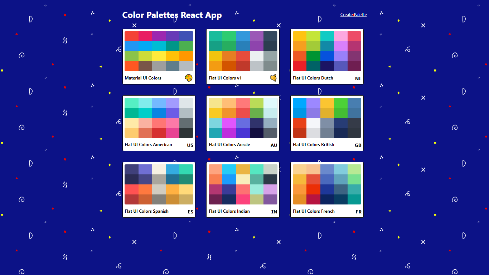
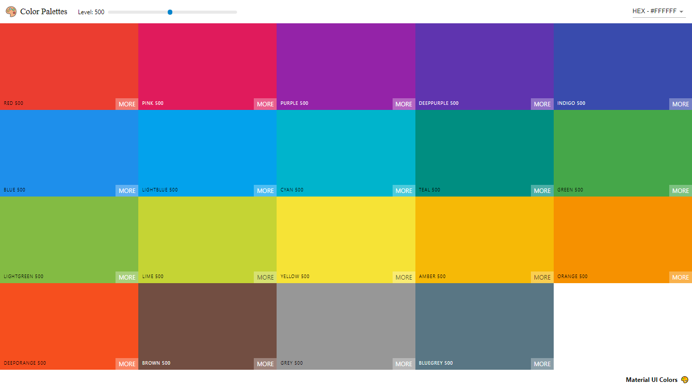
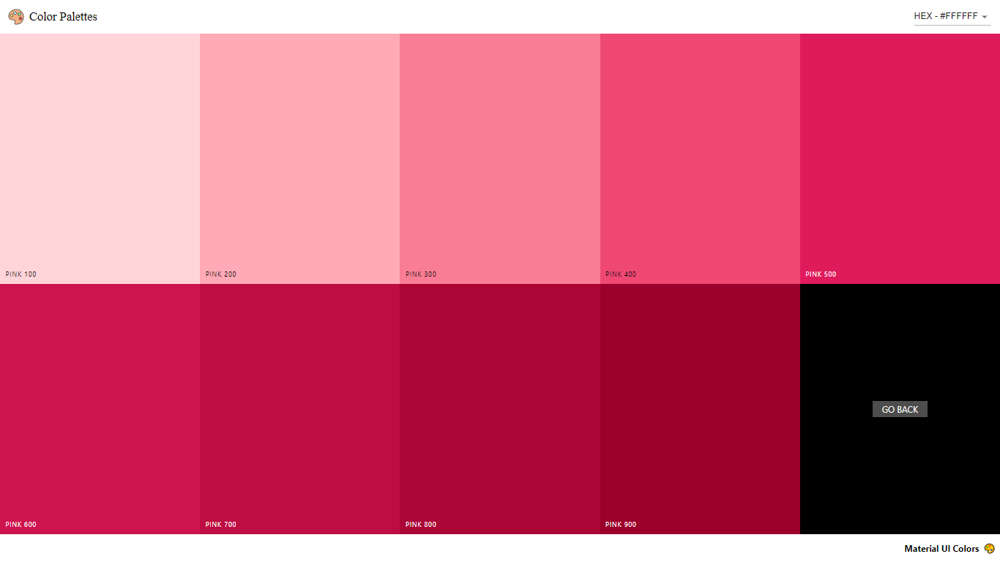
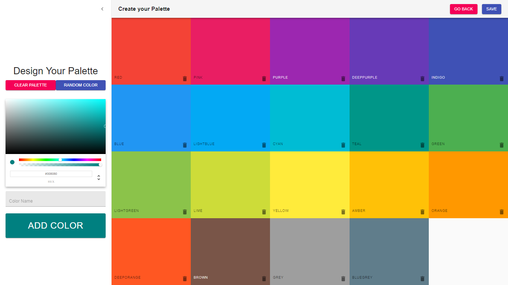

<h1 align="center">Color Palettes</h1>
<h4 align="center">
   
</h4>

  <a href="https://color-palettes-react-app.now.sh/">Web Page</a>&nbsp;&nbsp;&nbsp;|&nbsp;&nbsp;&nbsp;
  <a href="#wrench-built-with">Built With</a>&nbsp;&nbsp;&nbsp;|&nbsp;&nbsp;&nbsp;
  <a href="#page_facing_up-about">About</a>&nbsp;&nbsp;&nbsp;|&nbsp;&nbsp;&nbsp;
  <a href="#-how-to-use">How to Use</a>&nbsp;&nbsp;&nbsp;|&nbsp;&nbsp;&nbsp;
  <a href="#heart_eyes-pages">Pages</a>&nbsp;&nbsp;&nbsp;|&nbsp;&nbsp;&nbsp;
  <a href="#-how-to-contribute">How to Contribute</a>&nbsp;&nbsp;&nbsp;|&nbsp;&nbsp;&nbsp;
  <a href="#pencil-author">Author</a>

## :wrench: Built With

- [React](https://reactjs.org)
- [React router](https://www.npmjs.com/package/react-router-dom)
- [Material UI](https://material-ui.com/pt/)
- [Chroma JS](https://github.com/gka/chroma.js/)
- [React Beautiful DND](https://github.com/atlassian/react-beautiful-dnd)
- [Emoji Mart](https://github.com/missive/emoji-mart)
- [React Sortable HOC](https://github.com/clauderic/react-sortable-hoc)
- [React Copy to Clipboard](https://github.com/nkbt/react-copy-to-clipboard)
- [React Form Validation](https://www.npmjs.com/package/react-form-validator-core)
- [React Transition Group](https://github.com/reactjs/react-transition-group)

## :page_facing_up: About

This is a project I've made to learn [React](https://reactjs.org). A clone of websites like [Flat UI Colors](https://flatuicolors.com/) and [Material UI Colors](http://materialuicolors.co/?utm_source=launchers). It was important so I managed to learn patterns to deal in a big project with React and how to make a Responsive App.

I've also learned how to deal with Draggable boxes even up and down and also side to side. React Sortable HOC in order to sort the boxes after the user drag and drop. [Material UI](https://material-ui.com/pt/) Icons and Components. ChromaJS to get the Luminance of each color box and chance the text colors to make it visible. [Emoji Picker](https://github.com/missive/emoji-mart) so the user can select and emoji the add to the Color Palette. Also I've learned to with JSS in React to style the Application and much more.

## 💻 How to Use

#### Online

You can use the App in this site: https://color-palettes-react-app.now.sh/

#### Locally

- Clone the project: `git clone https://github.com/Lukazovic/color-palettes-react-app.git`;
- Go to the project folder: `cd color-palettes-react-app`;
- Download the dependencies: `npm install`;
- Start the application: `npm start`.

It will open a browser page (if it doesn't, go to [http://localhost:3000](http://localhost:3000/)).

## :heart_eyes: Pages

<h3 align="center">Home Page</h3>
<h4 align="center">
   
</h4>

In this page you will be able to see all the Palettes including the ones you created. Also, here's where you can delete the Palettes.

<h3 align="center">Palette Page</h3>
<h4 align="center">
   
</h4>

In this page you can see all the colors in a specific Palette. You can copy the color you want by click in the box and select if you want it in HEX, RGB or RGBA. Also you can make the colors lighter or darker.

<h3 align="center">Single Color Page</h3>
<h4 align="center">
   
</h4>

In this page you can see all the shades of a specific color and copy just like the previous one.

<h3 align="center">Create New Palette Page</h3>
<h4 align="center">
   
</h4>

This is the page where you can create your Palette. You are able to select the color in a Color Picker and give it a name or even generate Random Colors to get some ideas of colors. **You can even organize the color boxes by dragging and drop them in the place you want**.

After select the colors you want in your pallete and how they are organized, you can choose a Name and an Emoji to your Palette.

## 🤔 How to Contribute

- Fork this repository;
- Create your branch with your feature: `git checkout -b my-feature`;
- Commit your feature: `git commit -m 'feat: My new feature'`;
- Push to your branch: `git push origin my-feature`.

Then merge your pull request, you can now delete your branch

## :pencil: Author

<table>
  <tr>
    <td align="center"><a href="https://github.com/Lukazovic"> <b>Lucas Vieira</b></a> </td>
  <tr>
</table>
